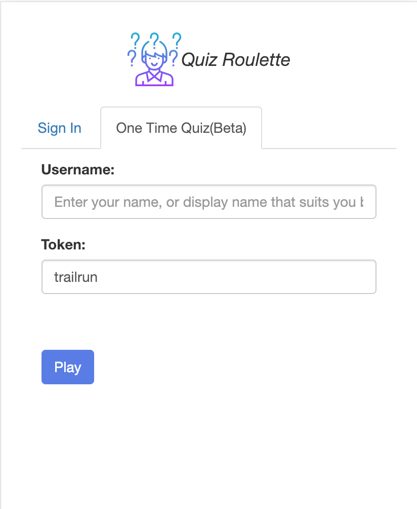
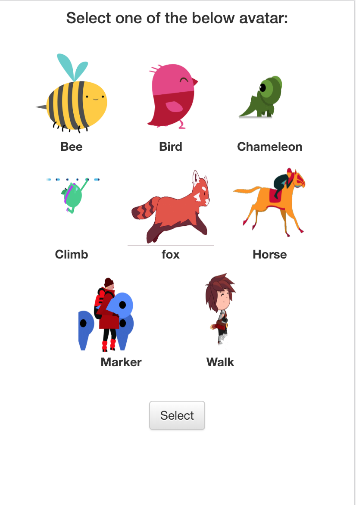
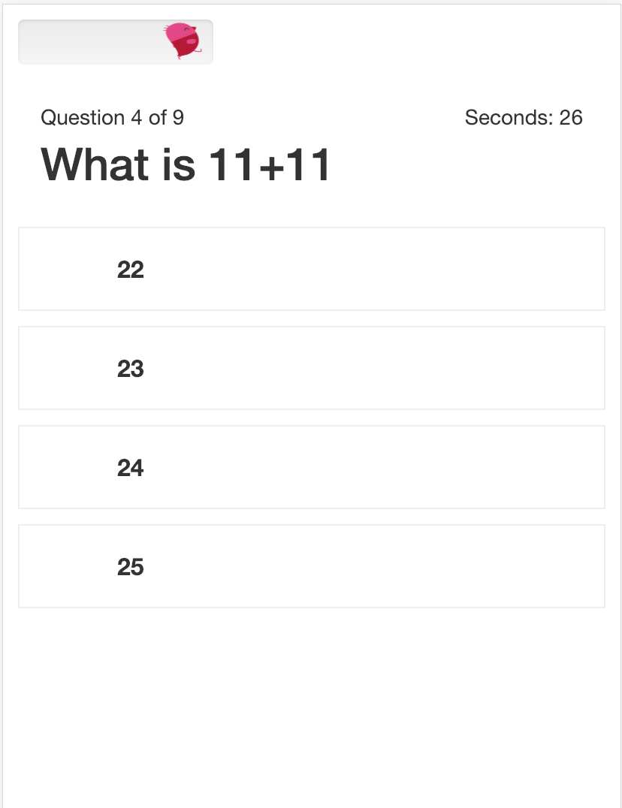
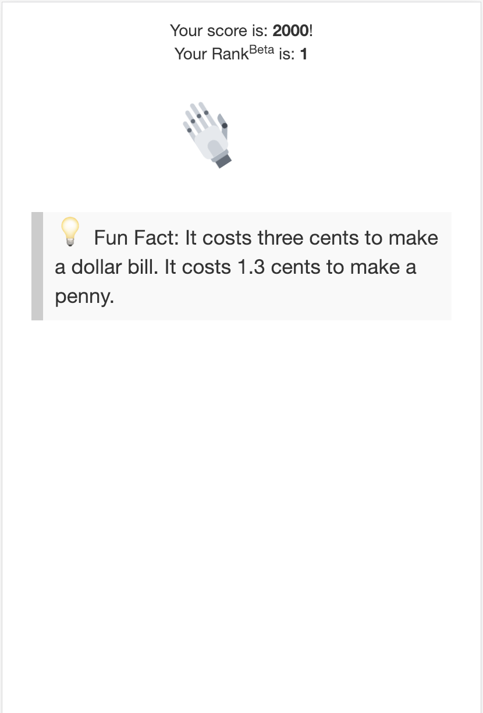

# Quiz Roulette

## Features

- login
- calendar view
- dashboard
- quiz list
  - play quiz
  - result
- summary of quiz score

## Technology Stack

- ReactJS (Front End)
- NodeJS (Back End) @Axperience-Server
- NodeJS (Socket - Real Time) @Axperience
- SQL-Server (Database - Microsoft Azure)

## Screen Grab

- Login



- Select Avatar



- Quiz Time



- Question with Image


- Result



## Contributors

- [Smit](https://github.com/shah-smit)
- [Xerxes](https://github.com/XXerxesG)


## Dockerization

Step 1 - Build Image

```docker
docker build --no-cache -t quiz-roulette/player-game . -f Dockerfile
docker build -t quizroulette/player-game:v1.0.0 .
docker push quizroulette/player-game:v1.0.0
```

Step 2 - Run the Image

docker run \
    -itd \
    --rm \
    -v ${PWD}:/app \
    -v /app/node_modules \
    -p 32000:3000 \
    -e CHOKIDAR_USEPOLLING=true \
    quiz-roulette/player-game:latest

docker rmi $(docker images -f "dangling=true" -q)


Step 3 - Run in KubeCtl